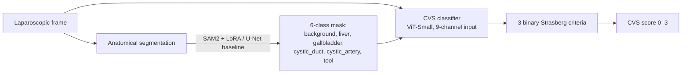

# Surgical CVS AI — Automated Critical View of Safety Assessment

Automated assessment of the **Critical View of Safety (CVS)** in laparoscopic
cholecystectomy: pixel-level anatomical segmentation → Strasberg 3-criteria
classification → a frame-level CVS achievement score (0–3).

> **Research prototype — not for clinical use.**

This work replicates and extends the DeepCVS / LG-CVS / Endoscapes2023
benchmark line of research.

---

## 1. Motivation

Laparoscopic cholecystectomy is one of the most common abdominal operations.
**Bile duct injury (BDI)** is its most feared complication; the majority of
BDIs stem from misidentification of anatomy. The **Critical View of Safety**,
introduced by Strasberg, is the surgical safety standard intended to prevent
this misidentification.

- BDI incidence in laparoscopic cholecystectomy: `[CITATION NEEDED]`
- Proportion of BDIs attributable to misidentification: `[CITATION NEEDED]`

Automating CVS assessment offers a path to intraoperative decision support and
objective surgical-quality measurement.

## 2. Method



**Segmentation.** Primary model: `facebook/sam2-hiera-base-plus`, loaded via
`transformers.Sam2Model`. LoRA adapters (rank 8) are applied to the Hiera image
encoder's attention; the small mask decoder is fully fine-tuned and repurposed
to emit a prompt-free dense 6-class logit map (`num_multimask_outputs = 6`, no
point/box prompts). Baseline: EfficientNet-B4 U-Net.

**Temporal variant** (`model=sam2_temporal`). Adds a lightweight ConvGRU head
over a window of `T = 3` consecutive frames' native mask-decoder outputs and a
zero-init residual: at initialisation it reproduces the frame-level model
exactly, and training only learns the temporal correction. Output stays
`(B, num_classes, H, W)` for the target (last) frame — a drop-in for the shared
`SegmentationModule`. Aimed at thin, flickering structures (`cystic_duct`); see
`src/models/temporal.py` for the rationale on why the fusion is at decoder
outputs rather than encoder embeddings.

**CVS classification.** ViT-Small backbone consuming a 9-channel input
(6-channel segmentation mask + RGB frame), with three independent binary heads
for Strasberg's criteria.

Training details: PyTorch Lightning + Hydra, mixed precision (bf16, with
automatic fp16 fallback on non-Ampere GPUs), AdamW with separate
encoder/decoder learning rates, cosine schedule with 5-epoch warmup, full seed
control and deterministic algorithms. The loss is focal + a configurable region
term — Dice, or **Focal-Tversky** (`β>α`) for the thin `cystic_duct`/
`cystic_artery` classes, where the dominant error is a miss (false negative)
rather than a false positive. See `configs/` for exact hyperparameters.

## 3. Results

Numbers are produced by actual experiments — do **not** edit cells to
non-`TBD` values until the corresponding run has completed.

### CholecSeg8k segmentation (test split, 1834 frames)

| Method | mIoU | Cystic Duct Dice | CVS mAP |
|---|---|---|---|
| U-Net (ours) | TBD | TBD | TBD |
| SAM2 + LoRA (ours) | TBD | TBD | TBD |
| **SAM2 + LoRA + temporal (ours)** | **0.703 (0.696–0.709)** | **0.000 (0.000–0.000)** | TBD |
| SAM2 zero-shot | TBD | TBD | TBD |
| DeepCVS (Mascagni 2022, reported) | — | — | 71.9 |
| LG-CVS (Murali 2023, reported) | — | — | 80.6 |

Per-class Dice (temporal model, only model trained so far): background 0.945,
liver 0.849, gallbladder 0.606, **cystic_duct 0.000**, tool 0.805. The
`cystic_artery` class has no CholecSeg8k labels; it will be learned from
Endoscapes2023.

**Why `cystic_duct = 0` — the real root cause.** A pre-training scan
(`notebooks/08_pretrain_validation.ipynb`) of the *whole* CholecSeg8k train
split found the cystic duct in **2 frames, 3 pixels total** — confirmed
independently in both `color_mask` and `watershed_mask` (canonical duct index
25). CholecSeg8k, in this version, effectively **does not label the cystic
duct** (and never labels the cystic artery). So the earlier "needs more training
time" story was wrong: there was almost no label to learn from. The CVS-critical
tubular structures (duct *and* artery) are therefore learned from
**Endoscapes2023**, which annotates both (`src/data/endoscapes_seg.py`);
CholecSeg8k still supplies the large anatomy (liver/gallbladder/tool). The
training-side fixes below remain necessary for the duct/artery on Endoscapes
(they are small and rare there too) — they were just not *sufficient* on a
dataset that lacks the labels.

**Training-side fixes for the (now Endoscapes-sourced) thin classes.** Earlier
analysis of the first run also surfaced real training bugs, all fixed: (1) early
stopping monitored `val_cystic_duct_dice` (mode=max,
patience=10), so on a near-zero-prevalence class it read "10 epochs at 0" as no
improvement and cut training at epoch 11/99; (2) the WeightedRandomSampler that
oversamples rare-class frames was *frame-indexed and therefore disabled for the
temporal model*, so the only model trained so far saw the duct at its natural <0.1%
prevalence; (3) the inverse-sqrt loss weight was clipped to 10, the same cap as
the common classes. Frame-level visualization (notebook 07) confirms the large
classes (liver/gallbladder/tool) were learnt well; the duct simply was barely
seen and barely weighted. All four are now addressed in code — a clip-level
sampler for the temporal path (`window_sample_weights`), `min_epochs=40` plus
patience 25 so early stopping can't fire during the warmup, a loss-weight clip
raised to 30, and a region loss redesigned for thin structures (Focal-Tversky,
`β=0.7 > α=0.3`, which penalizes *misses* harder than false positives). A fifth,
SOTA-derived lever attacks the root cause — rarity itself: **rare-class
copy-paste** (Ghiasi et al., CVPR 2021; the augmentation behind SurgiSAM2's
+0.37 cystic_duct / +0.32 cystic_artery Dice gains) harvests duct patches and
pastes them onto other frames, manufacturing rare-class instances and
boundaries rather than only re-weighting the few that exist (opt-in:
`copy_paste.enabled=true`). All are pending the next training run to confirm the
duct leaves zero. Before committing to that
multi-hour run, `notebooks/08_pretrain_validation.ipynb` checks in minutes
whether the fixes can work: it inspects label sparsity, quantifies the sampler's
duct-exposure boost, contrasts Dice vs Focal-Tversky on a synthetic thin
structure, shows copy-paste raising duct prevalence before/after, and overfits a
single duct-containing batch to prove the model+loss+labels can represent the
duct at all.

Qualitative examples: see `notebooks/07_results_visualization.ipynb` (loads
the trained checkpoints from HuggingFace and renders
`[input | GT | <each model>]` side by side).

### Trained checkpoints (HuggingFace)

The first full run's checkpoints, benchmark table, train log and run notes are
stored at
**[`duckbin/surgical-sam2-temporal`](https://huggingface.co/duckbin/surgical-sam2-temporal)**
(private). Download with `hf download duckbin/surgical-sam2-temporal
sam2_temporal_results.zip --repo-type=model && unzip
sam2_temporal_results.zip` to restore `outputs/sam2_temporal/best.ckpt` and
`results/benchmark_table.md`.

## 4. Reproducing

**On Google Colab** — open `notebooks/run_pipeline.ipynb` and run it top
to bottom. It is idempotent (safe to re-run after a disconnect) and resumes
interrupted training from the last checkpoint. The manual steps below are the
equivalent.

```bash
# 1. Environment (Python >= 3.11; Colab / RunPod GPU runtime recommended)
pip install -r requirements.txt
# torch is preinstalled on Colab/RunPod; SAM2 loads via transformers (Sam2Model)
# — no separate install.

# 2. Data
bash scripts/download_cholecseg8k.sh
# Endoscapes2023 requires PhysioNet credentialed access — download manually
# to ./data/endoscapes2023/, then:
bash scripts/prepare_endoscapes.sh

# 3. Train: SAM2 + LoRA segmentation, then the CVS classifier.
#    Checkpoints are written to outputs/<model>/best.ckpt; train_cvs and the
#    benchmark runner read them automatically.
python -m src.train.train_segmentation model=sam2_lora   # or model=unet_baseline
# Temporal variant: a ConvGRU head over a window of T=3 consecutive frames,
# targeting cystic_duct recall + frame-to-frame consistency (drop-in output).
python -m src.train.train_segmentation model=sam2_temporal
# cystic_duct/cystic_artery: CholecSeg8k barely labels these, so learn them from
# Endoscapes-Seg instead (frame-level; copy-paste recommended for the rare classes):
python -m src.train.train_segmentation data=endoscapes2023_seg model=sam2_lora \
       copy_paste.enabled=true
python -m src.train.train_cvs

# 4. Benchmark + visualization + demo
python -m src.eval.benchmark_runner    # -> results/benchmark_table.md
# Visual comparison of the three trained models (input | GT | U-Net | SAM2 | temporal):
#   open notebooks/07_results_visualization.ipynb  (reads outputs/*/best.ckpt)
python -m app.gradio_demo              # interactive CVS assessment demo
```

### Running on RunPod (A100, recommended for the full run)

The repo defaults are wired for a single 24 GB A100 (or 16 GB T4 with
`low_memory=true`). To reproduce on a RunPod A100 pod end-to-end:

```bash
# 1. Create the pod
#    Template: "PyTorch 2.x" (CUDA 12.x)  GPU: A100 (80 GB or 40 GB both fine)
#    Volume:   60 GB+ (CholecSeg8k ~3 GB + 3 checkpoints ~3-6 GB + scratch)
#    Open the pod's Jupyter / Web Terminal.

# 2. Clone + install (one-off, ~3 min)
git clone https://github.com/duck-bin/surgical-ai.git && cd surgical-ai
pip install -r requirements.txt

# 3. Data (~3 GB, ~20-40 min on first run; cached afterwards)
bash scripts/download_cholecseg8k.sh

# 4. Train the three segmentation models (~6-8 h each on A100;
#    low_memory=false lifts the per-device batch from 1 to 4)
python -m src.train.train_segmentation model=unet_baseline \
       low_memory=false num_workers=4
python -m src.train.train_segmentation model=sam2_lora      \
       low_memory=false num_workers=4
python -m src.train.train_segmentation model=sam2_temporal  \
       low_memory=false num_workers=4

# 5. Comparison table + visualization
python -m src.eval.benchmark_runner    # -> results/benchmark_table.md
#    then open notebooks/07_results_visualization.ipynb in Jupyter

# 6. (Optional) Stream training curves to wandb live (default mode=disabled)
python -m src.train.train_segmentation model=sam2_temporal wandb.mode=online
```

**Tips**

- Pod disconnects are safe — every run picks up the last checkpoint
  automatically. Just re-run the same `train_segmentation` command.
- If a model is too slow, drop to T4-style: `low_memory=true num_workers=2`.
- **Skip the one-time class-stats pass.** The first run computes per-class
  statistics over the train split (now mask-only and parallelized over
  `num_workers`, so it's a few minutes, not many). Keep `data.cache_dir` on the
  persistent volume and it's computed **once ever**; every later run/model loads
  `class_stats_*.npz` in seconds. Since the default split is deterministic, you
  can also `git add` that `.npz` once and commit it, so even a fresh clone skips
  the pass entirely.
- To visualise on a different machine (e.g. Colab) instead of the pod, just
  copy the `outputs/` folder over — notebook 07 reads from `outputs/<model>/best.ckpt`.

### Watching training progress

By default each run prints a per-epoch summary line straight to the terminal —
no wandb, no extra setup:

```text
[train] starting -- up to 100 epochs, 459 train batches/epoch
[class-stats] computing over 5734 train frames (one-time; cached afterwards)...
  [class-stats] 5734/5734 masks (41s)
[epoch   1/100]  612.4s  train_loss=1.8423  val_loss=1.5501  val_miou=0.3120  val_cystic_duct_dice=0.0000
[epoch   2/100]  598.1s  train_loss=1.2210  val_loss=1.1908  val_miou=0.4015  val_cystic_duct_dice=0.0000
```

This is the simplest way to confirm epochs are advancing on a RunPod pod. Set
`progress.bar=false` to suppress Lightning's in-epoch tqdm bar (useful when
redirecting stdout to a log file), or `progress.per_epoch=false` to drop the
summary line.

### Live training curves with Weights & Biases (optional)

Training logs `loss / val_miou / val_<class>_dice / val_cystic_duct_dice` every
epoch. By default these go to local files only (`wandb.mode=disabled`). To
stream them to the [wandb](https://wandb.ai) web UI so you can watch the run
from anywhere (phone, another laptop) without staying connected to the pod:

```bash
# Once per machine: install + paste your wandb API key (free signup, ~30 s)
pip install wandb && wandb login

# Add wandb.mode=online to any training command:
python -m src.train.train_segmentation model=sam2_temporal wandb.mode=online
```

This is **highly recommended for long runs on RunPod** — you can see whether
`val_cystic_duct_dice` is actually climbing without paying for the pod just to
watch a terminal. `wandb.project=surgical-cvs-ai` is preset; override it with
`wandb.project=<name>` if you want a different workspace.

The configs default to a 16 GB T4 (`low_memory: true` — per-device batch 1 with
16x gradient accumulation); set `low_memory=false` on a larger GPU. Expected
runtime and cost (RunPod A100, see Step-1 plan for details):

| Stage | Runtime (A100) | Approx. cost |
|---|---|---|
| CholecSeg8k segmentation training | ~6–8 h | ~$10–15 |
| Endoscapes CVS classifier | ~3–4 h | ~$5–8 |
| **Full reproduction** | — | **< $50** |

### Implementation progress (state of the repo)

What is wired and verified end-to-end:

- **Segmentation training** for `unet_baseline`, `sam2_lora`, `sam2_temporal`
  (Lightning + Hydra, bf16 mixed precision, AdamW + cosine + 5-epoch warmup,
  resume from `outputs/<model>/last.ckpt`).
- **Class-balance pipeline** with inverse-sqrt-frequency loss weights and a
  WeightedRandomSampler over the train split. The per-frame pass decodes **only
  the masks** at native resolution (skipping the RGB image decode and the
  letterbox-resize the eval transform would apply) and **fans the decode out
  across `num_workers`** processes, so the one-time pass is much shorter. It is
  cached to `<data.cache_dir>/class_stats_<loader>_seed<seed>.npz`, so re-runs /
  subsequent models start in seconds. The pass prints `[class-stats] N/M masks`
  progress so it's clearly working, not hung. Because the default split is
  deterministic, that `.npz` can even be committed/shared to skip the **first**
  run's pass entirely (see the RunPod tips).

  Counting native-resolution masks is also **more accurate**, not just faster:
  the old pass counted the *eval-transformed* mask, i.e. the 1024×1024 letterbox
  in which ~44% of pixels are zero-**padding** counted as `background` — so the
  measured class distribution was skewed (background inflated, every other class
  deflated). Native-resolution counts reflect the dataset's true distribution.
  The effect on training is negligible by design: the loss weights are clipped to
  `[0.5, 30]`, so the extreme classes are unchanged (`background` pins to the
  floor, `cystic_duct`/`cystic_artery` pin to the ceiling either way), and the
  sampler is unaffected — letterbox only *upsamples*, so per-frame class
  *presence* is identical, and the per-frame weights shift by a near-constant
  factor that `WeightedRandomSampler` normalizes away. (The stats cache carries a
  `version` field, so an older padding-contaminated `.npz` recomputes once.)
- **Terminal per-epoch progress.** An `EpochProgress` callback prints one
  flushed line per epoch — `[epoch 12/100] 87.3s train_loss=… val_miou=…
  val_cystic_duct_dice=…` — so a run is followable in a plain RunPod/Colab
  terminal (or a redirected log) without wandb. Toggle with `progress.per_epoch`
  / `progress.bar` (the latter silences Lightning's in-epoch tqdm bar when
  piping to a file).
- **Video-level split + sliding windows.** `CholecSeg8kWindowDataset` builds
  contiguous T-frame windows grouped by video, never crossing a video or
  train/val/test boundary; replay-consistent augmentation across the clip via
  `albumentations.ReplayCompose`.
- **Per-class metrics + checkpoint selection.** `val_<class>_dice` is logged
  every epoch (NaN-ignoring aggregation so rare classes don't poison the
  monitor), with `val_cystic_duct_dice` as the default selection metric.
- **wandb logger** is wired through `wandb.mode=online/offline/disabled`; the
  run is named after the model so the three models can be overlaid in one
  workspace.
- **Benchmark + visualization.** `benchmark_runner` evaluates each available
  checkpoint on the CholecSeg8k test split (1834 frames or 1834 windows for the
  temporal model) and writes `results/benchmark_table.md` with 95% bootstrap
  CIs. `notebooks/07_results_visualization.ipynb` pulls checkpoints from
  HuggingFace and renders `[input | GT | <each available model>]` side by side
  — it auto-detects which checkpoints are present, so it works with one model
  today and grows with the others.
- **Smoke tests** (CPU CI + a tiny notebook 06 run) keep the temporal path,
  Lightning module, and window dataset honest end-to-end.

What is **not** done yet (so the results table is what it is):

- Frame-level baselines (`unet_baseline`, `sam2_lora`) at full schedule —
  needed for a fair comparison.
- CVS classifier training (Endoscapes2023 — manual PhysioNet download required).
- Re-running `sam2_temporal` to lift `cystic_duct` Dice off zero. The three
  root causes (early-stop on the rare-class metric, the sampler being disabled
  for the temporal path, and the over-tight loss-weight clip) are fixed in code;
  the confirming training run has not been done yet. See Results and Limitations.

## 5. Limitations

- Single segmentation dataset (CholecSeg8k) for pretraining.
- Temporal modeling (`sam2_temporal`) is implemented and trained; the
  frame-level baselines (`unet_baseline`, `sam2_lora`) have not yet been
  trained to completion, so a fair frame-vs-temporal comparison is still
  pending.
- Ground truth is the public dataset annotations; not independently
  surgeon-validated by the author. Frame-level inspection of the trained model
  (notebook 07) suggests `cystic_duct` labels in CholecSeg8k are sparse and
  inconsistent — some frames show a clearly visible duct in the input that is
  not labelled in the ground-truth mask.
- `cystic_artery` is not labeled in CholecSeg8k; it is learned only from
  Endoscapes2023 (see Clinical Note and `src/data/cholecseg8k.py`).
- The first full `sam2_temporal` run early-stopped at epoch 11 because the
  selection metric (`val_cystic_duct_dice`) was 0 for that whole window, the
  rare-class sampler was inactive on the temporal path, and the duct's loss
  weight was capped low — see Results above. The other anatomical classes were
  learnt well. These causes are now fixed in code but the corrected run is still
  pending, so the headline duct Dice stays 0.000 until it completes.

## 6. Clinical Note

The **Critical View of Safety** is a method of target identification in
laparoscopic cholecystectomy. Before any structure is clipped or divided, the
surgeon establishes that the structures entering the gallbladder have been
unambiguously identified. Strasberg's three criteria are:

- **C1 — Two structures.** Two and only two tubular structures are seen
  entering the gallbladder (the cystic duct and the cystic artery).
- **C2 — Hepatocystic triangle cleared.** The hepatocystic triangle is cleared
  of fat and fibrous/connective tissue.
- **C3 — Cystic plate exposed.** The lower one-third of the cystic plate (the
  gallbladder bed on the liver) is exposed.

The CVS score in this project is the sum of the three satisfied criteria
(0–3), matching the Strasberg formulation. Achieving CVS does not require an
intraoperative cholangiogram; it is a visual, anatomy-based safety checkpoint
whose purpose is to prevent the cystic duct / common bile duct
misidentification that underlies most bile duct injuries.

## 7. Citations

<!-- TODO (Step 9): verify every BibTeX entry (authors, venue, year, IDs)
     against the primary source before publication. Entries below are
     placeholders and must not be cited as-is. -->

Datasets and key papers used in this project:

- CholecSeg8k — Hong et al., *CholecSeg8k: A Semantic Segmentation Dataset for
  Laparoscopic Cholecystectomy Based on Cholec80*. `% TODO: verify`
- Endoscapes2023 — Mascagni et al., *Scientific Data*, 2024. `% TODO: verify`
- SAM 2 — Ravi et al., *SAM 2: Segment Anything in Images and Videos*, 2024.
  `% TODO: verify`
- SurgiSAM2 — Kamtam et al., arXiv:2503.03942, 2025. `% TODO: verify`
- DeepCVS — Mascagni et al., 2022. `% TODO: verify`
- LG-CVS — Murali et al., 2023. `% TODO: verify`
- Strasberg & Brunt — *Rationale and use of the critical view of safety in
  laparoscopic cholecystectomy*. `% TODO: verify`

## License

MIT — see [LICENSE](LICENSE).
