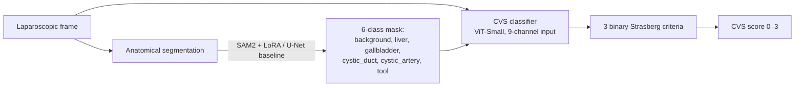

# Surgical CVS AI — Automated Critical View of Safety Assessment

Automated assessment of the **Critical View of Safety (CVS)** in laparoscopic
cholecystectomy: pixel-level anatomical segmentation → Strasberg 3-criteria
classification → a frame-level CVS achievement score (0–3).

> **Research prototype — not for clinical use.**

This work replicates and extends the DeepCVS / LG-CVS / Endoscapes2023
benchmark line of research.

---

## 1. Motivation

Laparoscopic cholecystectomy is one of the most common abdominal operations.
**Bile duct injury (BDI)** is its most feared complication; the majority of
BDIs stem from misidentification of anatomy. The **Critical View of Safety**,
introduced by Strasberg, is the surgical safety standard intended to prevent
this misidentification.

- BDI incidence in laparoscopic cholecystectomy: `[CITATION NEEDED]`
- Proportion of BDIs attributable to misidentification: `[CITATION NEEDED]`

Automating CVS assessment offers a path to intraoperative decision support and
objective surgical-quality measurement.

## 2. Method



**Segmentation.** Primary model: `facebook/sam2-hiera-base-plus` with LoRA
adapters on the image encoder (rank 8) and mask decoder (rank 16), used in
automatic-mask-generation mode. Baseline: EfficientNet-B4 U-Net.

**CVS classification.** ViT-Small backbone consuming a 9-channel input
(6-channel segmentation mask + RGB frame), with three independent binary heads
for Strasberg's criteria.

Training details: PyTorch Lightning + Hydra, mixed precision (bf16 on A100),
AdamW, cosine schedule with 5-epoch warmup, full seed control and deterministic
algorithms. See `configs/` for exact hyperparameters.

## 3. Results

All numbers are produced by actual experiments — do **not** edit cells to
non-`TBD` values until the corresponding run has completed.

| Method | mIoU | Cystic Duct Dice | CVS mAP |
|---|---|---|---|
| U-Net (ours) | TBD | TBD | TBD |
| SAM2 zero-shot | TBD | TBD | TBD |
| SAM2 + LoRA (ours) | TBD | TBD | TBD |
| DeepCVS (Mascagni 2022, reported) | — | — | 71.9 |
| LG-CVS (Murali 2023, reported) | — | — | 80.6 |

Qualitative examples: _TBD (added in Step 9)._

## 4. Reproducing

```bash
# 1. Environment (Python >= 3.11; Colab / RunPod GPU runtime recommended)
pip install -r requirements.txt
# torch is preinstalled on Colab/RunPod; SAM2 loads via transformers (Sam2Model)
# — no separate install.

# 2. Data
bash scripts/download_cholecseg8k.sh
# Endoscapes2023 requires PhysioNet credentialed access — download manually
# to ./data/endoscapes2023/, then:
bash scripts/prepare_endoscapes.sh

# 3. Train: SAM2 + LoRA segmentation, then the CVS classifier
python -m src.train.train_segmentation model=sam2_lora   # or model=unet_baseline
python -m src.train.train_cvs

# 4. Benchmark + demo
python -m src.eval.benchmark_runner    # -> results/benchmark_table.md
python -m app.gradio_demo              # interactive CVS assessment demo
```

The configs default to a 16 GB T4 (`low_memory: true` — per-device batch 1 with
16x gradient accumulation); set `low_memory=false` on a larger GPU. Expected
runtime and cost (RunPod A100, see Step-1 plan for details):

| Stage | Runtime (A100) | Approx. cost |
|---|---|---|
| CholecSeg8k segmentation training | ~6–8 h | ~$10–15 |
| Endoscapes CVS classifier | ~3–4 h | ~$5–8 |
| **Full reproduction** | — | **< $50** |

## 5. Limitations

- Single segmentation dataset (CholecSeg8k) for pretraining.
- No temporal modeling in v1 — frame-level predictions only.
- Ground truth is the public dataset annotations; not independently
  surgeon-validated by the author.
- `cystic_artery` is not labeled in CholecSeg8k; it is learned only from
  Endoscapes2023 (see Clinical Note and `src/data/cholecseg8k.py`).

## 6. Clinical Note

The **Critical View of Safety** is a method of target identification in
laparoscopic cholecystectomy. Before any structure is clipped or divided, the
surgeon establishes that the structures entering the gallbladder have been
unambiguously identified. Strasberg's three criteria are:

- **C1 — Two structures.** Two and only two tubular structures are seen
  entering the gallbladder (the cystic duct and the cystic artery).
- **C2 — Hepatocystic triangle cleared.** The hepatocystic triangle is cleared
  of fat and fibrous/connective tissue.
- **C3 — Cystic plate exposed.** The lower one-third of the cystic plate (the
  gallbladder bed on the liver) is exposed.

The CVS score in this project is the sum of the three satisfied criteria
(0–3), matching the Strasberg formulation. Achieving CVS does not require an
intraoperative cholangiogram; it is a visual, anatomy-based safety checkpoint
whose purpose is to prevent the cystic duct / common bile duct
misidentification that underlies most bile duct injuries.

## 7. Citations

<!-- TODO (Step 9): verify every BibTeX entry (authors, venue, year, IDs)
     against the primary source before publication. Entries below are
     placeholders and must not be cited as-is. -->

Datasets and key papers used in this project:

- CholecSeg8k — Hong et al., *CholecSeg8k: A Semantic Segmentation Dataset for
  Laparoscopic Cholecystectomy Based on Cholec80*. `% TODO: verify`
- Endoscapes2023 — Mascagni et al., *Scientific Data*, 2024. `% TODO: verify`
- SAM 2 — Ravi et al., *SAM 2: Segment Anything in Images and Videos*, 2024.
  `% TODO: verify`
- SurgiSAM2 — Kamtam et al., arXiv:2503.03942, 2025. `% TODO: verify`
- DeepCVS — Mascagni et al., 2022. `% TODO: verify`
- LG-CVS — Murali et al., 2023. `% TODO: verify`
- Strasberg & Brunt — *Rationale and use of the critical view of safety in
  laparoscopic cholecystectomy*. `% TODO: verify`

## License

MIT — see [LICENSE](LICENSE).
